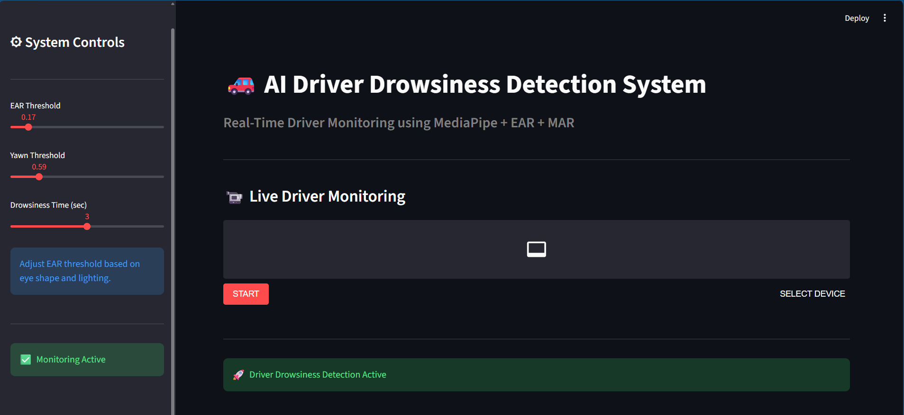

# 🚗 AI Driver Drowsiness Detection System

A real-time AI-powered driver monitoring system that detects drowsiness and yawning using MediaPipe facial landmarks, Eye Aspect Ratio (EAR), and Mouth Aspect Ratio (MAR) with an interactive Streamlit interface.

---

## 📌 Features

- Real-time webcam monitoring
- Driver drowsiness detection
- Yawn detection system
- Audio alert/alarm system
- Interactive Streamlit UI
- Facial landmark tracking using MediaPipe
- Adjustable EAR and MAR thresholds
- Live fatigue monitoring

---

## 🛠 Technologies Used

- Python
- OpenCV
- MediaPipe
- Streamlit
- Streamlit-WebRTC
- NumPy
- SciPy
- Pygame

---

## 🧠 Detection Logic

### 👁 Eye Aspect Ratio (EAR)
Used for detecting prolonged eye closure to identify driver drowsiness.

### 👄 Mouth Aspect Ratio (MAR)
Used for detecting yawning behavior based on mouth opening.

---

## 📷 Demo Screenshot



---

## 📂 Project Structure

```bash
AI-Driver-Drowsiness-Detection/
│
├── app.py
├── requirements.txt
├── alarm.wav
├── screenshots/
│   └── UI.png
└── README.md
```

---

## ⚙ Installation

Clone the repository:

```bash
git clone https://github.com/ManishaGurugubelli/AI-Driver-Drowsiness-Detection.git
```

Move into the project folder:

```bash
cd AI-Driver-Drowsiness-Detection
```

Install dependencies:

```bash
pip install -r requirements.txt
```

---

## ▶ Run the Project

```bash
streamlit run app.py
```

---

## 🎯 Applications

- Driver safety systems
- Smart vehicle monitoring
- Fatigue detection systems
- Real-time human monitoring
- Computer vision research projects

---

## ⚠ Limitations

Detection accuracy may vary depending on:
- lighting conditions
- camera quality
- face angle
- eye shape
- webcam resolution

---

## 👩‍💻 Author

**Manisha Gurugubelli**

---

